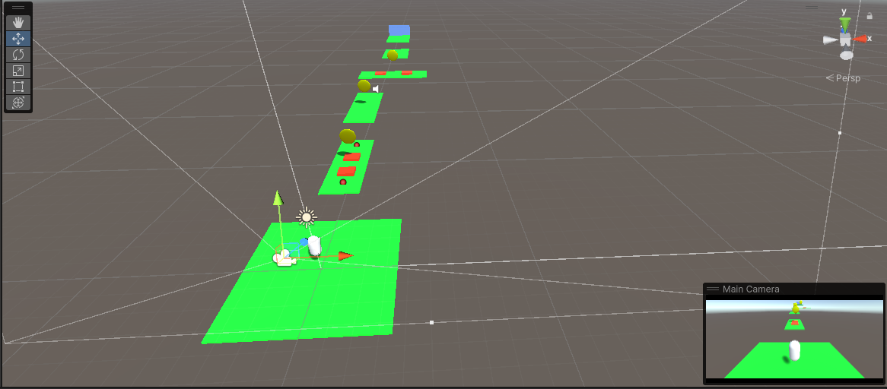
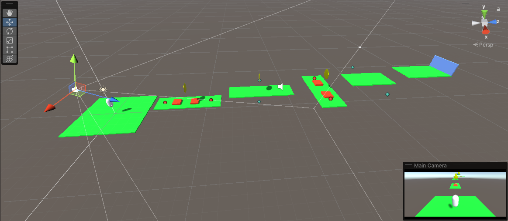
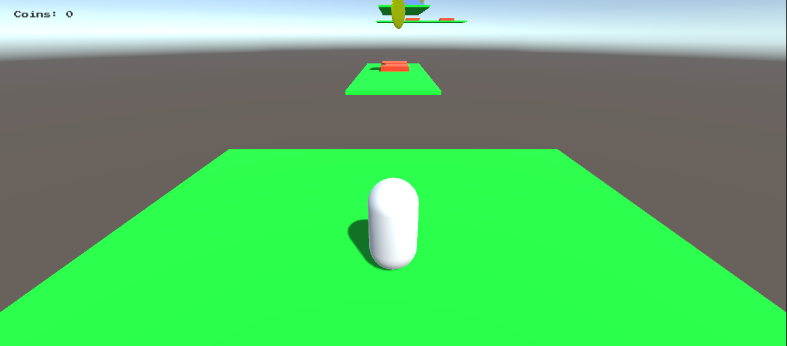

# Unity3D-Simple-Game

Welcome to Unity3D-Simple-Game! This repository contains a simple game developed using Unity3D. The purpose of this project is to provide a basic example of a game built with Unity and serve as a starting point for beginners.

## Setup

To set up the project, follow the steps below:

1. Clone this repository to your local machine or download the ZIP file.
2. Open Unity3D.
3. Click on "Open" and navigate to the location where you cloned or downloaded the repository.
4. Select the root folder of the project and click "Open".
5. Unity will import the project and set it up for you.

## Screenshots

Here are some screenshots of the game:

## How to Play

Once the project is set up, you can play the game by following these steps:

1. Navigate to the "BuildGame" folder in the project.
2. Locate the executable file named "Simple Game" (or "Simple Game.exe" on Windows).
3. Double-click on the file to launch the game.

## Controls

Use the following controls to play the game:

- **Arrow Keys**: Move the character.
- **Spacebar**: Jump.
- **Mouse Click**: Interact with objects.

## Acknowledgments

Special thanks to the Unity community for providing valuable resources and tutorials that helped in the development of this simple game.

Enjoy playing Unity3D-Simple-Game! If you have any questions or feedback, please don't hesitate to reach out.
